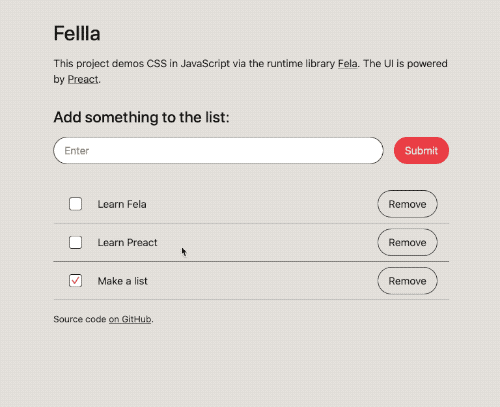

# Fellla

_Experimentation with [Fela][fela]_

This project experiments with Fela and [Preact][preact], with a little help from [TypeScript][typescript] and [Parcel v2][parcle].

## Running

```shell
# Use the project's version of Node.js:
nvm use

# Install dependencies:
yarn

# Start the Parcel server:
yarn start
```

Open the app up at http://localhost:1234.



(Alternatively, start the [React Styleguidist][styleguidist] server with `yarn styleguide`.)

[fela]: https://fela.js.org
[parcle]: https://github.com/parcel-bundler/parcel
[preact]: https://preactjs.com
[styleguidist]: https://react-styleguidist.js.org
[typescript]: https://www.typescriptlang.org